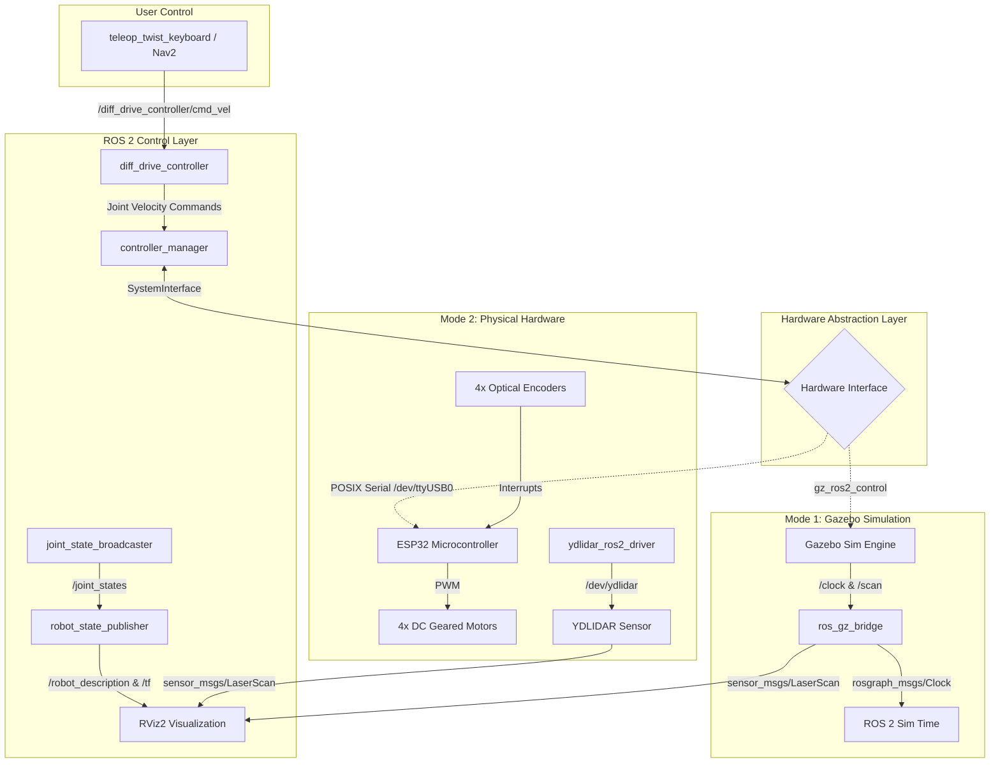

# 🚗 4WD LiDAR Mobile Robot (`car_robot`)

[](https://docs.ros.org/)
[](https://gazebosim.org/)
[](https://control.ros.org/)
[](https://github.com/)
[](LICENSE)

A complete, production-grade ROS 2 mobile robotics stack featuring a 4-wheel drive (4WD) skid-steer chassis equipped with a 2D 360° LiDAR.

This repository provides **dual-mode operational parity**:
1. **High-Fidelity Simulation:** Modern Gazebo (`ros_gz`) simulation with GPU-accelerated ray tracing for LiDAR, realistic skid-steer wheel friction dynamics, and synchronized `ros2_control` hardware abstraction.
2. **Physical Hardware Deployment:** Custom C++ `hardware_interface::SystemInterface` plugin communicating bi-directionally over POSIX serial with an **ESP32** microcontroller for closed-loop 4-motor PWM control and optical quadrature encoder feedback, alongside integrated drivers for **YDLIDAR**.

---

## 📑 Table of Contents
- [Project Overview](#-project-overview)
- [System Architecture](#-system-architecture)
  - [Software & Hardware Stack](#software--hardware-stack)
  - [ROS 2 Package Breakdown](#ros-2-package-breakdown)
  - [Transform (TF) Tree](#transform-tf-tree)
  - [Microcontroller Serial Protocol](#microcontroller-serial-protocol)
- [Robot Physical Specifications](#-robot-physical-specifications)
- [How to Set Up on Any Laptop](#-how-to-set-up-on-any-laptop)
  - [1. Prerequisites](#1-prerequisites)
  - [2. System Dependencies Installation](#2-system-dependencies-installation)
  - [3. Workspace Creation & Build](#3-workspace-creation--build)
  - [4. Environment Setup](#4-environment-setup)
- [Running the Robot](#-running-the-robot)
  - [Option A: URDF Model Inspection (RViz2)](#option-a-urdf-model-inspection-rviz2)
  - [Option B: Full Gazebo Simulation + RViz2 + LiDAR](#option-b-full-gazebo-simulation--rviz2--lidar)
  - [Option C: Driving with Teleoperation](#option-c-driving-with-teleoperation)
  - [Option D: Physical Robot Execution](#option-d-physical-robot-execution)
- [Calibration & Tuning](#-calibration--tuning)
- [Troubleshooting & Common Pitfalls](#-troubleshooting--common-pitfalls)
- [License](#-license)

---

## 🌟 Project Overview

The **car_robot** platform is designed for research, education, and development in autonomous mobile robotics (AMR), simultaneous localization and mapping (SLAM), and path navigation.

Key capabilities include:
- **Modular URDF/Xacro Design:** Parametric definitions for chassis, wheels, inertia, collision geometries, visual meshes, and sensor mounts.
- **Skid-Steer / Differential Kinematics:** Utilizing `diff_drive_controller` from `ros2_controllers` configured to command two pairs of coupled wheels (front/rear left and front/rear right).
- **Surface Friction Optimization:** Carefully tuned anisotropic friction parameters (`mu1=1.0`, `mu2=0.2`) in Gazebo to prevent rotational dragging commonly found in 4-wheel skid-steer simulations.
- **Real-Time Gazebo Bridge:** High-throughput `ros_gz_bridge` translating native Gazebo sensor topics (`/scan`, `/clock`) into standard ROS 2 message formats.
- **Unified Control Abstraction:** Switch between simulated hardware (`gz_ros2_control/GazeboSimSystem`) and real microcontrollers (`car_base_hardware/CarBaseHardwareInterface`) without changing high-level controller nodes or teleoperation scripts.

---

## 🏗️ System Architecture

### Software & Hardware Stack



### ROS 2 Package Breakdown

| Package | Purpose | Key Files |
| :--- | :--- | :--- |
| **`car_robot_description`** | Defines kinematics, geometries, visual meshes, and Gazebo plugins | • `urdf/car_robot.urdf.xacro` (Master)<br>• `urdf/car_base.xacro` (Chassis & 4 wheels)<br>• `urdf/lidar.xacro` (2D LiDAR sensor)<br>• `urdf/car_robot_gazebo_ros2_control.xacro` (Gazebo integration)<br>• `meshes/lds.stl` (LiDAR 3D mesh) |
| **`car_robot_bringup`** | Central orchestrator for launching nodes, controllers, and bridges | • `launch/car_robot_gazebo.launch.xml` (Gazebo + RViz)<br>• `launch/car_robot.launch.xml` (Hardware bringup)<br>• `config/my_robot_controller.yaml` (DiffDrive parameters)<br>• `config/gazebo_bridge.yaml` (Topic mappings) |
| **`car_robot_hardware`** | Custom C++ `ros2_control` hardware interface for physical vehicle | • `include/car_robot_hardware/motor_driver.hpp` (POSIX serial driver)<br>• `src/car_base_hardware_interface.cpp` (Plugin implementation)<br>• `car_robot_hardware_interface.xml` (Pluginlib definition) |
| **`ydlidar_ros2_driver`** | Vendor-supported driver for physical 2D LiDAR sensors | • `params/ydlidar.yaml` (Baudrate, frequency, port)<br>• `launch/ydlidar_launch.py` (Driver node launcher) |

### Transform (TF) Tree

The system maintains a standard ROS REP-105 transform tree:
```
odom
 └── base_footprint (Projected on ground plane)
      └── base_link (Center of robot chassis)
           ├── lidar_link (Mounted on top of base_link)
           ├── fl_wheel_link (Front Left Wheel)
           ├── fr_wheel_link (Front Right Wheel)
           ├── rl_wheel_link (Rear Left Wheel)
           └── rr_wheel_link (Rear Right Wheel)
```

### Microcontroller Serial Protocol

The C++ hardware interface communicates with the ESP32 over serial at **115200 baud** using a lightweight, human-readable ASCII packet format:

1. **Commands to ESP32 (Write):**
   ```text
   m <PWM_FL> <PWM_FR> <PWM_RL> <PWM_RR>\n
   ```
   *Values range between `-255` and `+255`.*
   Example: `m 120 120 120 120\n` (Drive forward)

2. **Feedback from ESP32 (Read):**
   ```text
   e <TICKS_FL> <TICKS_FR> <TICKS_RL> <TICKS_RR>\n
   ```
   *Cumulative encoder pulse counts.*
   Example: `e 1420 1418 1422 1419\n`

---

## 📐 Robot Physical Specifications

| Parameter | Value | Notes |
| :--- | :--- | :--- |
| **Chassis Dimensions** | 250 mm (L) × 150 mm (W) × 70 mm (H) | Lightweight acrylic/aluminum chassis |
| **Wheel Diameter** | 70 mm (Radius: 35 mm) | Rubber high-traction tires |
| **Wheel Width** | 25 mm | Width per tire |
| **Track Width (Separation)** | 175 mm | Distance between left and right wheel centers |
| **Wheelbase** | 125 mm | Distance between front and rear axle |
| **Drive Configuration** | 4WD Skid-Steer | 4 independent DC motors driven in pairs |
| **Encoder Resolution** | 20 pulses per revolution (PPR) | Optical disc encoders |
| **Max Wheel Speed** | 200 RPM | Approx. 0.73 m/s max linear velocity |
| **LiDAR Sensor** | 360° 2D Laser Scanner | 0.1 m – 8.0 m range, 360 samples/rev |

---

## 💻 How to Set Up on Any Laptop

Follow this universal guide to run this project on any laptop running **Ubuntu 22.04 LTS (with ROS 2 Humble)**, **Ubuntu 24.04 LTS (with ROS 2 Jazzy)**, or **Windows 11 with WSL2 (Ubuntu + WSLg)**.

### 1. Prerequisites

- **OS:** Ubuntu 22.04 LTS / 24.04 LTS or Windows 11 with WSL2.
- **ROS 2:** Humble Hawksbill or Jazzy Jalisco installed.
  - *If you need to install ROS 2, follow the [Official ROS 2 Installation Guide](https://docs.ros.org/en/humble/Installation.html).*

> [!NOTE]
> If running on **Windows with WSL2**, ensure WSLg is enabled so Gazebo and RViz graphical windows open seamlessly.

### 2. System Dependencies Installation

Open your terminal and run:

```bash
# Update package lists
sudo apt update && sudo apt upgrade -y

# Install ROS 2 build tools
sudo apt install -y \
  python3-colcon-common-extensions \
  python3-rosdep \
  git \
  build-essential

# Install Gazebo Sim and ROS 2 Control packages
# Replace ${ROS_DISTRO} with 'humble' or 'jazzy'
sudo apt install -y \
  ros-${ROS_DISTRO}-ros-gz \
  ros-${ROS_DISTRO}-ros-gz-sim \
  ros-${ROS_DISTRO}-ros-gz-bridge \
  ros-${ROS_DISTRO}-gz-ros2-control \
  ros-${ROS_DISTRO}-ros2-control \
  ros-${ROS_DISTRO}-ros2-controllers \
  ros-${ROS_DISTRO}-diff-drive-controller \
  ros-${ROS_DISTRO}-joint-state-broadcaster \
  ros-${ROS_DISTRO}-xacro \
  ros-${ROS_DISTRO}-rviz2 \
  ros-${ROS_DISTRO}-joint-state-publisher-gui \
  ros-${ROS_DISTRO}-teleop-twist-keyboard
```

### 3. Workspace Creation & Build

Clone this repository into your active ROS 2 workspace:

```bash
# 1. Create a workspace directory (or use an existing one)
mkdir -p ~/lidar_robot_ws/src
cd ~/lidar_robot_ws

# 2. Clone the repository
git clone https://github.com/karim-raouf/lidar-mobile-robot.git src/lidar_robot_car
# (Or if you already have the files locally, copy or symlink them into ~/lidar_robot_ws/src)

# 3. Initialize and update rosdep
sudo rosdep init 2>/dev/null || true
rosdep update
rosdep install --from-paths src --ignore-src -r -y

# 4. Build the workspace
colcon build --symlink-install
```

### 4. Environment Setup

Source your workspace in every new terminal, or add it to your `~/.bashrc`:

```bash
# Source current workspace
source install/setup.bash

# Optional: Add to ~/.bashrc for automatic loading
echo "source ~/lidar_robot_ws/install/setup.bash" >> ~/.bashrc
```

---

## 🚀 Running the Robot

### Option A: URDF Model Inspection (RViz2)

To verify the robot's physical visual model, coordinate frames, and joint limits without launching the physics simulator:

```bash
ros2 launch car_robot_description display.launch.xml
```
*A GUI slider will appear allowing you to inspect each joint's rotation.*

---

### Option B: Full Gazebo Simulation + RViz2 + LiDAR

To start the complete simulation with:
- Modern Gazebo physics simulation (`empty.sdf -r`)
- Simulated 4-wheel robot spawned at ground level (`-z 0.05`)
- GPU LiDAR sensor publishing active scans to `/scan`
- `joint_state_broadcaster` and `diff_drive_controller` active
- RViz2 synchronized to simulation time (`use_sim_time:=true`)

Run:
```bash
ros2 launch car_robot_bringup car_robot_gazebo.launch.xml
```

You will see:
1. **Gazebo Window:** Displays the 3D robot model in an empty world.
2. **RViz2 Window:** Displays the robot model, the TF coordinate frames, and the live laser scan points (in red/rainbow).

---

### Option C: Driving with Teleoperation

Open a **new terminal** and launch the keyboard teleoperation node:

```bash
source ~/lidar_robot_ws/install/setup.bash

# Note: The controller expects geometry_msgs/msg/TwistStamped
ros2 run teleop_twist_keyboard teleop_twist_keyboard \
  --ros-args --remap cmd_vel:=/diff_drive_controller/cmd_vel \
  -p stamped:=true
```

**Keyboard Controls:**
- `i` : Move forward
- `,` : Move backward
- `j` : Turn left (in-place skid steer)
- `l` : Turn right (in-place skid steer)
- `k` : Stop
- `q` / `z` : Increase / Decrease max linear speed by 10%
- `w` / `x` : Increase / Decrease max angular speed by 10%

---

### Option D: Physical Robot Execution

When deploying to the actual hardware vehicle:

1. **Connect the USB Devices:**
   - Plug in the ESP32 USB cable (typically registers as `/dev/ttyUSB0`).
   - Plug in the YDLIDAR USB cable (typically registers as `/dev/ttyUSB1` or `/dev/ydlidar`).

2. **Grant Serial Port Permissions:**
   ```bash
   sudo usermod -a -G dialout $USER
   sudo chmod 666 /dev/ttyUSB*
   ```

3. **Launch the Hardware Bringup:**
   ```bash
   # Terminal 1: Launch Robot State & Hardware Controller
   ros2 launch car_robot_bringup car_robot.launch.xml

   # Terminal 2: Launch the YDLIDAR Driver
   ros2 launch ydlidar_ros2_driver ydlidar_launch.py
   ```

---

## ⚙️ Calibration & Tuning

All control parameters are centrally located in:
[`src/car_robot_bringup/config/my_robot_controller.yaml`](file:///d:/lidar_robot_car/src/car_robot_bringup/config/my_robot_controller.yaml)

### Skid-Steer Turning Multiplier
Because 4-wheel skid-steer chassis experience lateral wheel slip during rotation, you can calibrate turning accuracy using `wheel_separation_multiplier`:
- If the robot turns **less** in reality/simulation than what RViz odometry reports: **increase** `wheel_separation_multiplier` (e.g., `1.15` - `1.25`).
- If straight-line traveled distance differs from measured distance: adjust `wheel_radius_multiplier` (e.g., `0.98` - `1.02`).

### Speed and Acceleration Profiles
```yaml
diff_drive_controller:
  ros__parameters:
    linear.x.max_velocity: 2.0       # m/s
    linear.x.max_acceleration: 1.0   # m/s^2
    angular.z.max_velocity: 2.0      # rad/s
    angular.z.max_acceleration: 2.0  # rad/s^2
```

---

## 🔧 Troubleshooting & Common Pitfalls

### 1. Gazebo Shows Black Screen or Crashes on Laptop / WSL2
If running under WSL2 or on a laptop with integrated graphics:
```bash
# Force software rendering for Gazebo / OGRE
export LIBGL_ALWAYS_SOFTWARE=1
# Or ensure hardware acceleration is active
export MESA_D3D12_DEFAULT_ADAPTER_NAME=NVIDIA
```

### 2. Robot Jitters or Fails to Turn in Simulation
4-wheel drive vehicles must slip their wheels laterally to turn. This is already handled in [`car_robot_gazebo_ros2_control.xacro`](file:///d:/lidar_robot_car/src/car_robot_description/urdf/car_robot_gazebo_ros2_control.xacro):
```xml
<mu1>1.0</mu1>  <!-- Forward traction -->
<mu2>0.2</mu2>  <!-- Low lateral friction to permit turning -->
```
Ensure these values are retained in your URDF.

### 3. "Failed to open serial port: /dev/ttyUSB0"
- Verify which port the ESP32 is mounted on using `ls /dev/ttyUSB*` or `dmesg | grep tty`.
- Edit `serial_port` in [`src/car_robot_description/urdf/car_base.ros2_control.xacro`](file:///d:/lidar_robot_car/src/car_robot_description/urdf/car_base.ros2_control.xacro).
- Ensure your user has dialout privileges: `sudo usermod -aG dialout $USER`.

### 4. Controller Manager Spawner Timeout
If `spawner diff_drive_controller` reports that it timed out waiting for the service:
- Check that `ros_gz_sim` successfully loaded the `gz_ros2_control-system` plugin.
- Ensure `GZ_SIM_RESOURCE_PATH` is exported (handled automatically by `car_robot_gazebo.launch.xml`).

---

## 📄 License

This project is licensed under the Apache License 2.0. Feel free to use, modify, and distribute for personal, educational, or commercial robotics applications.
